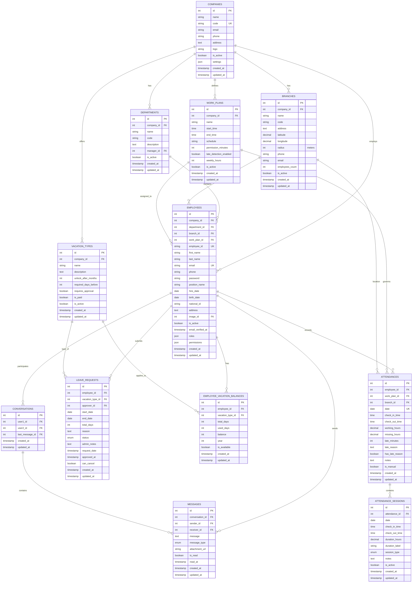
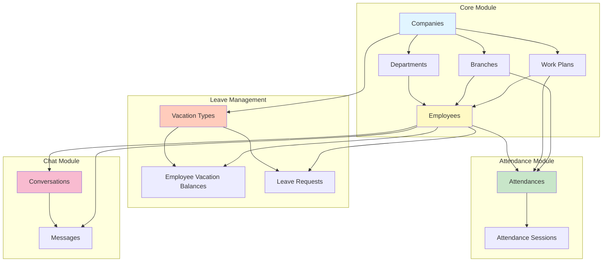
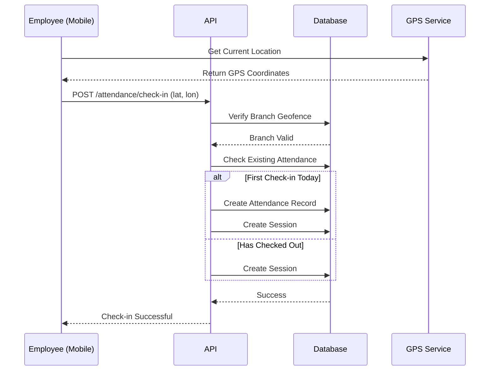
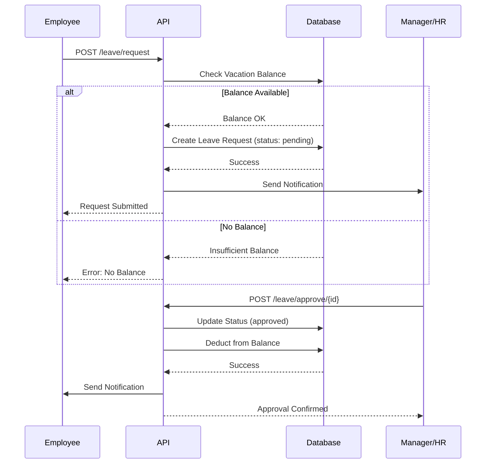
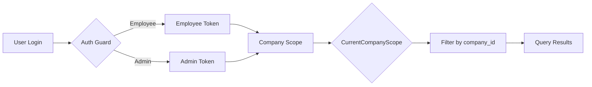

# HRM System - Visual ERD Diagram

## 📊 Entity Relationship Diagram (Mermaid)



---

## 📊 Simplified Module View



---

## 🔄 Data Flow Diagrams

### Attendance Check-in Flow


### Leave Request Flow


---

## 📈 Database Statistics

### Table Sizes (Estimated)

| Table | Typical Row Count | Growth Rate | Index Count |
|-------|------------------|-------------|-------------|
| companies | 1-100 | Low | 1 (PK) |
| departments | 10-500 | Low | 2 (PK, FK) |
| branches | 5-200 | Low | 3 (PK, FK, GPS) |
| employees | 50-10,000 | Medium | 5 (PK, 4 FK, email) |
| attendances | 50k-1M+ | High (daily) | 4 (PK, 2 FK, date) |
| attendance_sessions | 100k-2M+ | High (daily) | 3 (PK, FK, date) |
| leave_requests | 5k-100k | Medium | 3 (PK, 2 FK) |
| messages | 10k-500k | High | 4 (PK, 2 FK, conv) |

---

## 🔐 Security Model



**Key Security Features:**
- ✅ Global Scope: All queries auto-filtered by `company_id`
- ✅ JWT Tokens: Stored securely in `flutter_secure_storage`
- ✅ Password Hashing: bcrypt
- ✅ API Rate Limiting
- ✅ CORS Protection
- ✅ Input Validation

---

## 📊 Performance Optimizations

### Indexes Strategy
```sql
-- High-traffic queries
CREATE INDEX idx_att_emp_date ON attendances(employee_id, date);
CREATE INDEX idx_att_sess_date ON attendance_sessions(attendance_id, date);
CREATE INDEX idx_msg_conv_time ON messages(conversation_id, created_at);
CREATE INDEX idx_leave_emp_status ON leave_requests(employee_id, status);

-- Geofencing queries
CREATE SPATIAL INDEX idx_branch_location ON branches(latitude, longitude);
```

### Caching Strategy
- **Employee Data**: Cache for 1 hour
- **Attendance Today**: Cache for 5 minutes
- **Vacation Balances**: Cache for 30 minutes
- **Work Plans**: Cache for 24 hours

---

## 🎯 API Endpoints Summary

### Authentication
- `POST /api/v1/auth/login` - Employee login
- `POST /api/v1/auth/admin/login` - Admin login
- `POST /api/v1/auth/logout` - Logout

### Attendance
- `GET /api/v1/employee/attendance/status` - Today's status
- `POST /api/v1/employee/attendance/check-in` - Check-in
- `POST /api/v1/employee/attendance/check-out` - Check-out
- `GET /api/v1/employee/attendance/sessions` - Today's sessions
- `GET /api/v1/employee/attendance/history` - History

### Leave Management
- `GET /api/v1/employee/leave/types` - Available vacation types
- `GET /api/v1/employee/leave/balance` - Current balance
- `POST /api/v1/employee/leave/request` - Submit leave request
- `GET /api/v1/employee/leave/history` - Request history
- `DELETE /api/v1/employee/leave/{id}` - Cancel request

### Chat (To Be Implemented)
- `GET /api/v1/chat/conversations` - Get conversations
- `POST /api/v1/chat/conversations` - Start new conversation
- `GET /api/v1/chat/conversations/{id}/messages` - Get messages
- `POST /api/v1/chat/conversations/{id}/messages` - Send message
- `PUT /api/v1/chat/conversations/{id}/read` - Mark as read

---

**Generated by:** Claude Code
**Date:** 2025-11-13
**Version:** 2.3.0

